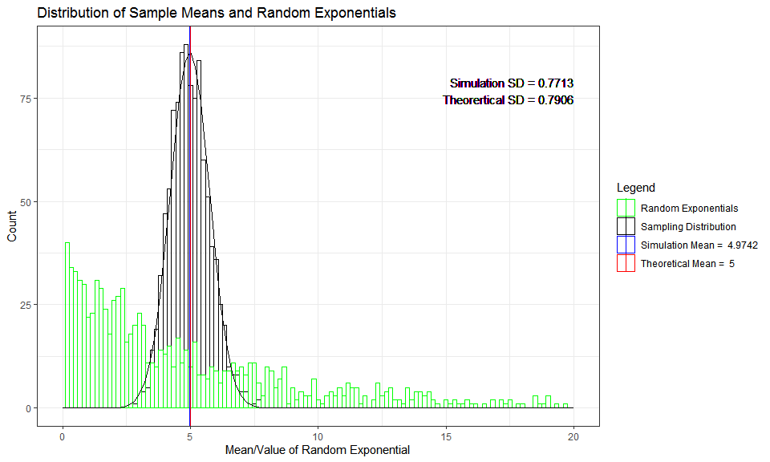
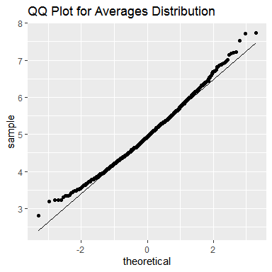

### 1. Overview:

This document shows how the mean of an exponential distribuion can be estimated using the Central limit Theorem (CLT). Firstly, random numbers have been generated from the exponential distribution. Then, means of such random numbers (across simulations) have been calculated to show that the distribution of such means is normal (gaussian).
<br>
Furthermore, mean of the distribution of averages is shown to be an unbiased estimator of the mean of the the orginal distribution (exponential distribution in our case). Additionally, variance of the distribution of the averages has been related to the variance of the exponential function.

***

### 2. Simulations: The code below does the simulations in the following way:
    * A seed is set to make the code reproducible
    * Generates `nsim`*`sample_size` random exponential numbers
    * Creates a `means_summary` dataframe to hold the averages of `nsim` simulations
    * Creates an additional column `ExpRandoms` in `means_summary` dataframe containing `nsim` random exponential numbers. This is done to ,later on, compare distribution of averages with the distribution of exponentials
    


```r
nsim <- 1000
sample_size <- 40
lambda <- 0.2
set.seed(1234)

simulations <- matrix(data=rexp(n=nsim*sample_size,rate=lambda), nrow=nsim, ncol=sample_size)
means_summary <- data.table(means=rowMeans(x=simulations))
means_summary[, ExpRandoms := rexp(n=nsim, rate=lambda)]
```

***

### 3. Sample Mean vs Theoretical Mean:

Sample Mean is quite close to the Theoretical Mean. Thus Sample mean is an unbiased estimator of the population mean.


```r
simulation_mean <- mean(means_summary[,means])
theorertical_mean <- 1/lambda
simulation_mean_label <- paste('Simulation Mean = ',round(simulation_mean,4))
theoretical_mean_label <- paste('Theoretical Mean = ',round(theorertical_mean,4))

print(simulation_mean_label)
[1] "Simulation Mean =  4.9742"
print(theoretical_mean_label)
[1] "Theoretical Mean =  5"
```

***

### 4. Sample Variance vs Theoretical Variance:

Theoretical Variance is $\frac{1}{sample\,size}$ times the variance of the exponential distribution. Thus, as the sample size for simulations increases, the variance of the distribution of averages decreases. Our sample variance is quite close to the theoretical variance of the averages distribution.


```r
simulation_sd <- sd(means_summary[,means])
theoretical_sd <- 1/lambda/sqrt(sample_size)

print(paste('Simulation Variance', round(simulation_sd^2,4), sep=' = '))
[1] "Simulation Variance = 0.595"
print(paste('Theorertical Variance', round(theoretical_sd^2,4), sep=' = '))
[1] "Theorertical Variance = 0.625"
```

***

### 5. Plotting the Distributions: The plots below show the following:

* Distribution of the averages of the random exponentials (black)
* Distribution of the random exponentials (green)
* Simulation Mean (blue), Theoretical Mean (red)
* Simulation and Theoretical Standard Deviations
* A normal plot overlain on top of the distribtion of averages (black)

We can infer the following from the figure:

* The distribution of averages is normal despite the exponential function not being normal. Thus, CLT is shown to be true
* The simulation and theoretical means are quite close
* The simulation and theoretical standard deviations/variances are quite close


```r
binwidth <- 1/6
labels <- c('Sampling Distribution','Random Exponentials',simulation_mean_label,
            theoretical_mean_label)
variance_text_box <- paste(paste('Simulation SD', round(simulation_sd,4), sep=' = '),
                           paste('Theorertical SD', round(theoretical_sd,4), sep=' = '), sep='\n')

ggplot(data=means_summary, mapping=aes(x=means)) + 
  geom_histogram(mapping=aes(x=means, color='MeanExpRandom'),binwidth=binwidth, fill=NA) +
  geom_histogram(mapping=aes(x=ExpRandoms, color='ExpRandom'),binwidth=binwidth, fill=NA) +
  stat_function(fun = function(x, mean, sd, n) n*dnorm(x=x, mean=mean, sd=sd), 
                args = list(mean=simulation_mean, sd=simulation_sd, n=nsim*binwidth)) +
  geom_vline(mapping=aes(xintercept=simulation_mean, color='SimulationMean')) +
  geom_vline(mapping=aes(xintercept=1/lambda, color='TheoreticalMean')) +
  labs(title='Distribution of Sample Means and Random Exponentials', 
       x='Mean/Value of Random Exponential', y='Count') +
  scale_color_manual(name = "Legend", values = 
                       c(MeanExpRandom='black', ExpRandom='green', 
                         SimulationMean = "blue", TheoreticalMean = "red"),
                     labels=c(MeanExpRandom='Sampling Distribution', ExpRandom='Random Exponentials',
                              SimulationMean=simulation_mean_label, TheoreticalMean=theoretical_mean_label)) + 
  geom_text(aes(x=20, y=80,label = variance_text_box), vjust = "inward", hjust = "inward", color='black') +
  theme_bw() + xlim(0,20)
```

<!-- -->

***

## Appendix
### Additional Proof of the normality of Averages Distribution:

The QQ Plot, shown below, of the averages distribution coincides with the theoretical line for a normal distribution.


```r
ggplot(data=means_summary, mapping=aes(sample=means)) +
  stat_qq() + stat_qq_line() +
  labs(title='QQ Plot for Averages Distribution')
```

<!-- -->

