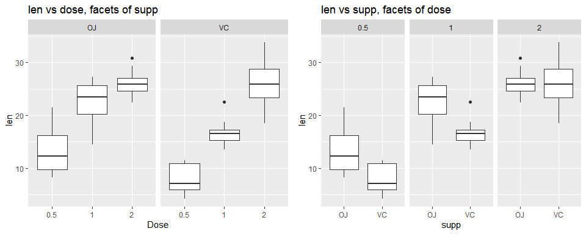

### 1. Overview:

This documnent analyses the Tooth Growth dataset provided by datasets package of R. Firstly, an introduction of the dataset is presented. Then, Exploratory Data Analysis of the dataset has been done. Lastly, t-tests have been performed to draw inferences from the dataset.

***

### 2. ToothGrowth Dataset:

The tooth growth data contains the length of odontoblasts (cells responsible for tooth growth) in 60 guinea pigs. Each animal received one of three dose levels of vitamin C (0.5, 1, and 2 mg/day) by one of two delivery methods, orange juice (OJ) or ascorbic acid (a form of vitamin C and coded as VC). The column names of the dataset are as shown below.


```r
data("ToothGrowth")
setDT(ToothGrowth)
colnames(ToothGrowth)
```

```
[1] "len"  "supp" "dose"
```

***

### 3. Exploratory Data Analysis:

* The following shows the number of observations for each dose and supp combination. 

```r
table(ToothGrowth$supp, ToothGrowth$dose)
    
     0.5  1  2
  OJ  10 10 10
  VC  10 10 10
```
<br>

* Let us now dig deeper and check how the length of odontoblasts varies with dosage levels and delivery methods. From the boxplots below we can gauge the following:

  * Higher dosage is leading to better outcomes
  * Orange Juice is leading to better outcomes


```r
g1 <- ggplot(data=ToothGrowth, aes(x=as.factor(dose), y=len))+ geom_boxplot() + facet_wrap(.~supp)+
  labs(title='len vs dose, facets of supp', x='Dose', y='len')
g2 <- ggplot(data=ToothGrowth, aes(x=supp, y=len))+ geom_boxplot() + facet_wrap(.~as.factor(dose))+
  labs(title='len vs supp, facets of dose', x='supp', y='len')
 grid.arrange(g1,g2, ncol=2)
```

<!-- -->

<br>

### 4. Stastical Testing:

i) Assumptions:

  * The guinea pigs are representative of the population of pigs
  * The guinea pigs are randomly assigned to different doses and delivery methods
  * Variances among different subgroups may not be equal. Thus, we will be using unequal variances t-test
  * The sample data distributions are mostly symmetric and mound shaped. Thus, we will be using t-tests
  * 5% significance level is assumed for judging the p-values as significant

<br>

ii) Comparing Delivery Methods:

a) Dosage 0.5 mg/day: The difference is statistically significant as p value is less than 0.05

```r
x <- ToothGrowth[supp=='OJ' & dose==0.5,len]
y <- ToothGrowth[supp=='VC' & dose==0.5,len]
t.test(x=x, y=y, alternative='greater', mu=0, paired=FALSE, var.equal=FALSE, conf.level=0.95)$p.value
```

```
[1] 0.003179303
```

b) Dosage 1 mg/day: The difference is statistically significant as p value is less than 0.05

```r
x <- ToothGrowth[supp=='OJ' & dose==1, len]
y <- ToothGrowth[supp=='VC' & dose==1, len]
t.test(x=x, y=y, alternative='greater', mu=0, paired=FALSE, var.equal=FALSE, conf.level=0.95)$p.value
```

```
[1] 0.0005191879
```

c) Dosage 2 mg/day: The difference is **not statistically significant** as p value is **more** than 0.05

```r
x <- ToothGrowth[supp=='OJ' & dose==2, len]
y <- ToothGrowth[supp=='VC' & dose==2, len]
t.test(x=x, y=y, alternative='greater', mu=0, paired=FALSE, var.equal=FALSE, conf.level=0.95)$p.value
```

```
[1] 0.5180742
```
<br>

iii) Comparing Dosage Levels:

a)  0.5 mg/day vs 1 mg/day for Orange Juice: The difference is statistically significant as p value is less than 0.05  

```r
x <- ToothGrowth[supp=='OJ' & dose==1, len]
y <- ToothGrowth[supp=='OJ' & dose==0.5, len]
t.test(x=x, y=y, alternative='greater', mu=0, paired=FALSE, var.equal=FALSE, conf.level=0.95)$p.value
```

```
[1] 4.39246e-05
```

b) 0.5 mg/day vs 2 mg/day for Orange Juice: The difference is statistically significant as p value is less than 0.05

```r
x <- ToothGrowth[supp=='OJ' & dose==2, len]
y <- ToothGrowth[supp=='OJ' & dose==0.5, len]
t.test(x=x, y=y, alternative='greater', mu=0, paired=FALSE, var.equal=FALSE, conf.level=0.95)$p.value
```

```
[1] 6.618919e-07
```

c) 1 mg/day vs 2 mg/day for Orange Juice: The difference is statistically significant as p value is less than 0.05

```r
x <- ToothGrowth[supp=='OJ' & dose==2, len]
y <- ToothGrowth[supp=='OJ' & dose==1, len]
t.test(x=x, y=y, alternative='greater', mu=0, paired=FALSE, var.equal=FALSE, conf.level=0.95)$p.value
```

```
[1] 0.01959757
```

d)  0.5 mg/day vs 1 mg/day for Abscorbic Acid: The difference is statistically significant as p value is less than 0.05

```r
x <- ToothGrowth[supp=='VC' & dose==1, len]
y <- ToothGrowth[supp=='VC' & dose==0.5, len]
t.test(x=x, y=y, alternative='greater', mu=0, paired=FALSE, var.equal=FALSE, conf.level=0.95)$p.value
```

```
[1] 3.405509e-07
```

e) 0.5 mg/day vs 2 mg/day for Orange Juice: The difference is statistically significant as p value is less than 0.05

```r
x <- ToothGrowth[supp=='VC' & dose==2, len]
y <- ToothGrowth[supp=='VC' & dose==0.5, len]
t.test(x=x, y=y, alternative='greater', mu=0, paired=FALSE, var.equal=FALSE, conf.level=0.95)$p.value
```

```
[1] 2.340789e-08
```

f) 1 mg/day vs 2 mg/day for Orange Juice: The difference is statistically significant as p value is less than 0.05

```r
x <- ToothGrowth[supp=='VC' & dose==2, len]
y <- ToothGrowth[supp=='VC' & dose==1, len]
t.test(x=x, y=y, alternative='greater', mu=0, paired=FALSE, var.equal=FALSE, conf.level=0.95)$p.value
```

```
[1] 4.577802e-05
```

### 5. Conclusion:

From the above analysis, we may infer that relationship between higher dosage and longer odontoblasts is stastically significant. Additionally, Orange Juice led to better outcomes than abscorbic acid, except when dosage level was the highest i.e. 2 mg/day

